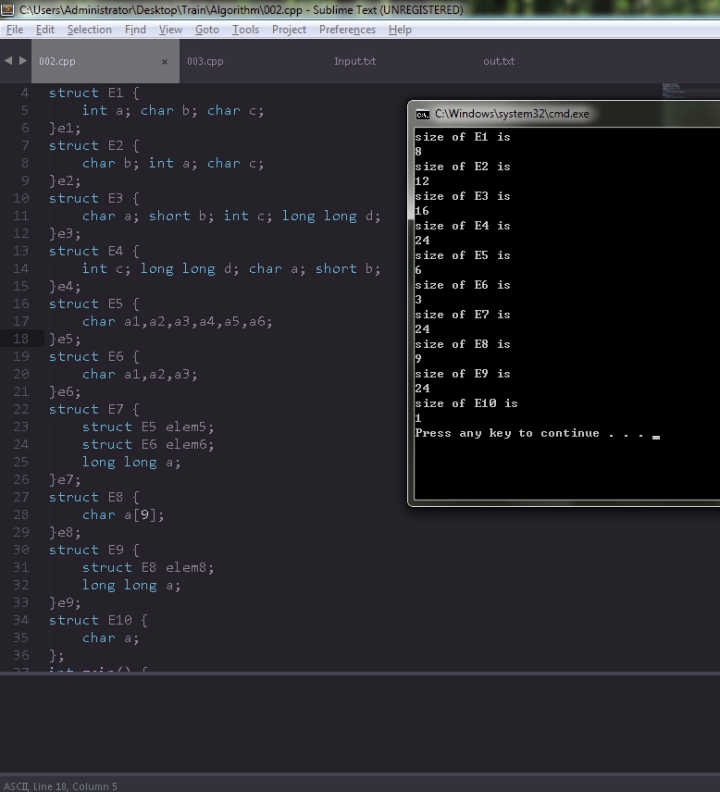
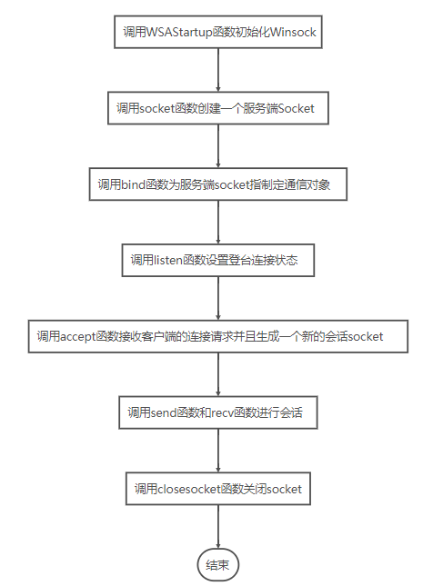
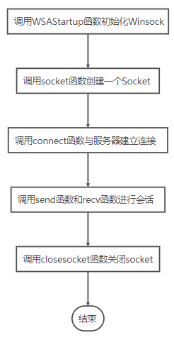

# C++基础与算法学习

> 目录
> 
[TOC]


## 1. 八大排序算法
_参考：
[1. CSDN八大经典排序算法](https://blog.csdn.net/youzhouliu/article/details/52311443)
[2. CSDN稳定与不稳定排序方法](https://blog.csdn.net/stand1210/article/details/52403569)_

#### 1.0 排序算法分类


-----

#### 1.1 直接插入排序

<font color="#0000cc" face="宋体" >**基本思想:**</font>

将一个记录插入到已排序好的有序表中，从而得到一个新，记录数增1的有序表。即：先将序列的第1个记录看成是一个有序的子序列，然后从第2个记录逐个进行插入，直至整个序列有序为止。
_要点：设立哨兵，作为临时存储和判断数组边界之用。_
如果碰见一个和插入元素相等的，那么插入元素把想插入的元素放在相等元素的后面。所以，相等元素的前后顺序没有改变，从原无序序列出去的顺序就是排好序后的顺序，所以插入排序是稳定的。

```c++
void InsertSort(int arr[], int n)
{
	int i, j, temp;
	for (i = 1; i<n; ++i)
	{
		temp = arr[i];    //设置哨兵，标记数组边界
		for(j = i-1; j>=0 && temp<arr[j]; --j)
		{
			arr[j+1] = arr[j];   //向后移动元素一格
		}
		arr[j+1] = temp;   //插入到正确位置
	}
}

```
<font color="#ff3300" face="宋体">* 其他插入排序：二分插入排序，2-路插入排序</font>

---

#### 1.2 希尔排序

希尔排序是1959 年由D.L.Shell 提出来的，相对直接排序有较大的改进。希尔排序又叫缩小增量排序

<font color="#0000cc" face="宋体" >**基本思想:**</font>

先将整个待排序的记录序列分割成为若干子序列分别进行直接插入排序，待整个序列中的记录“基本有序”时，再对全体记录进行依次直接插入排序。

<font color="#0000cc" face="宋体" >**操作方法:**</font>

 1. 选择一个增量序列t1，t2，…，tk，其中ti>tj，tk=1；
 2. 按增量序列个数k，对序列进行k趟排序；
 3. 每趟排序，根据对应的增量ti，将待排序列分割成若干长度为m 的子序列，分别对各子表进行直接插入排序。仅增量因子为1 时，整个序列作为一个表来处理，表长度即为整个序列的长度。
> 我们简单处理增量序列：增量序列d = {n/2 ,n/4, n/8 .....1} n为要排序数的个数, 即：先将要排序的一组记录按某个增量d（n/2,n为要排序数的个数）分成若干组子序列，每组中记录的下标相差d.对每组中全部元素进行直接插入排序，然后再用一个较小的增量（d/2）对它进行分组，在每组中再进行直接插入排序。继续不断缩小增量直至为1，最后使用直接插入排序完成排序。

```c++
void ShellInsertSort(int arr[], int n, int dk)
{
	for(int i=dk; i<n; ++i)
	{
		if(arr[i] < arr[i-dk])  //若第i个元素大于i-1元素，直接插入;小于的话，移动有序表后插入.
		{
			int temp = arr[i];   //设置哨兵
			//直接插入排序
			int j=i-dk;
			for(; j>=0 && temp < arr[j]; j-=dk)
			{
				arr[j+dk] = arr[j];
			}
			arr[j+dk] = temp;
		}
	}
}
//缩小增量迭代
void ShellSort(int arr[], int n)
{
	for(int dk = n/2; dk >= 1; dk/=2)
		ShellInsertSort(arr, n, dk);
}
```

希尔排序时效分析很难，关键码的比较次数与记录移动次数依赖于增量因子序列d的选取，特定情况下可以准确估算出关键码的比较次数和记录的移动次数。目前还没有人给出选取最好的增量因子序列的方法。增量因子序列可以有各种取法，有取奇数的，也有取质数的，但需要注意：增量因子中除1 外没有公因子，且最后一个增量因子必须为1。希尔排序方法是一个不稳定的排序方法。

---
#### 1.3 simple选择排序
<font color="#0000cc" face="宋体" >**基本思想:**</font>

在要排序的一组数中，选出最小（或者最大）的一个数与第1个位置的数交换；然后在剩下的数当中再找最小（或者最大）的与第2个位置的数交换，依次类推，直到第n-1个元素（倒数第二个数）和第n个元素（最后一个数）比较为止。
<font color="#0000cc" face="宋体" >**操作方法:**</font>

第一趟，从n 个记录中找出关键码最小的记录与第一个记录交换；
第二趟，从第二个记录开始的n-1 个记录中再选出关键码最小的记录与第二个记录交换；
以此类推.....
第i 趟，则从第i 个记录开始的n-i+1 个记录中选出关键码最小的记录与第i 个记录交换，
直到整个序列按关键码有序。

```c++
void sSelectionSort(int arr[], int n)
{
    unsigned int index;
    for(unsigned int i=0; i<n; ++i)
    {
        index = i;
        for(unsigned int j=i+1; j<n; ++j)
        {
            if(arr[j]<arr[index])
                index = j;
        }
        swap (arr[i], arr[index]);
    }
}
```
**simple选择排序的改进——二元选择排序**
简单选择排序，每趟循环只能确定一个元素排序后的定位。我们可以考虑改进为每趟循环确定两个元素（当前趟最大和最小记录）的位置,从而减少排序所需的循环次数。改进后对n个数据进行排序，最多只需进行[n/2]趟循环即可。具体实现如下：

```c++
void Select2Sort(int arr[], int n)
 {
    for(unsigned int i=0; i < n/2; ++i)
    {
        unsigned int min = i, max = n-1-i;
        for(unsigned int j=i+1; j<n-1-i; ++j)
        {
            if(arr[j]<arr[min])
                min = j;
            else if(arr[j]>arr[max])
                max = j;
        }
        swap(arr[i], arr[min]);
        swap(arr[n-1-i], arr[max]);
    }
 }
 ```
---
#### 1.4 堆排序

堆排序是一种树形选择排序，是对直接选择排序的有效改进。若以一维数组存储一个堆，则堆对应一棵完全二叉树，且所有非叶结点的值均不大于(或不小于)其子女的值，根结点（堆顶元素）的值是最小(或最大)的。
初始时把要排序的n个数的序列看作是一棵顺序存储的二叉树（一维数组存储二叉树），调整它们的存储序，使之成为一个堆，将堆顶元素输出，得到n 个元素中最小(或最大)的元素，这时堆的根节点的数最小（或者最大）。然后对前面(n-1)个元素重新调整使之成为堆，输出堆顶元素，得到n 个元素中次小(或次大)的元素。依此类推，直到只有两个节点的堆，并对它们作交换，最后得到有n个节点的有序序列。称这个过程为堆排序。

因此，实现堆排序需解决两个问题：
1. 如何将n 个待排序的数建成堆；
2. 输出堆顶元素后，怎样调整剩余n-1 个元素，使其成为一个新堆。

```c++
/**************************************************************
 *
 * 选择排序——堆排序（Heap Sort）
 * 时间复杂度：O(n) = nlogn
 *
 **************************************************************/
/**
 * 已知H[s…m]除了H[s] 外均满足堆的定义 
 * 调整H[s],使其成为大顶堆.即将对第s个结点为根的子树筛选,  
 * 
 * @param H是待调整的堆数组 
 * @param s是待调整的数组元素的位置 
 * @param n是数组的长度 
 * 
 */  
void HeapAdjust(int H[],int s, int n)  
{  
    int temp  = H[s];  
    int child = 2*s+1; //左孩子结点的位置。 
    while (child < n) 
    {  
        if(child+1 < n && H[child] < H[child+1])  //如果左子结点小于右子结点，child指向右子结点 
            ++child;
        if(H[s]<H[child]) 
        {   // 如果较大的子结点大于父结点  
            H[s] = H[child]; // 那么把较大的子结点往上移动，替换它的父结点  
            s = child;       // 重新设置s ,即待调整的下一个结点的位置  
            child = 2*s+1;  
        }  else {            // 如果当前待调整结点大于它的左右孩子，则不需要调整，直接退出  
             break;  
        }  
        H[s] = temp;         // 当前待调整的结点放到比其大的孩子结点位置上  
    }  
}  

/*
 * 初始堆进行调整 
 * 将H[0..n-1]建成堆 
 * 调整完之后第一个元素是序列的最小的元素 
 */  
void BuildingHeap(int H[], int n)  
{   
    //最后一个有孩子的节点的位置 i= (n -1) / 2  
    for (int i = (n -1) / 2 ; i >= 0; --i)  
        HeapAdjust(H,i,n);  
}  
/* 
 * 堆排序算法 
 */  
void HeapSort(int H[], int n)  
{  
    //初始堆  
    BuildingHeap(H, n);  
    //从最后一个元素开始对序列进行调整  
    for (int i = n - 1; i > 0; --i)  
    {  
        //交换堆顶元素H[0]和堆中最后一个元素  
        //int temp = H[i]; H[i] = H[0]; H[0] = temp;  
    	swap(H[i], H[0]);
        //每次交换堆顶元素和堆中最后一个元素之后，都要对堆进行调整  
        HeapAdjust(H,0,i);  
  }  
}
```
---
#### 1.5 冒泡排序 

这个不用多说，和选择排序很像，区别是每次找出相对大的数立即交换位置，直到冒泡到最后面，交换次数较多。

```c++
void BubbleSort(int arr[], int n)
{
    for(int i=0; i < n - 1; ++i)   //一共跑n-1趟
    {
        for(int j=0; j < n-1-i; ++j)   //将大数冒泡到最后面
        {
            if(arr[j+1] < arr[j])
                swap(arr[j], arr[j+1]);
        }
    }
}
```

---
#### 1.6 快速排序

<font color="#0000cc" face="宋体" >**基本思想:**</font>

1）选择一个基准元素,通常选择第一个元素或者最后一个元素;

2）通过一趟排序讲待排序的记录分割成独立的两部分，其中一部分记录的元素值均比基准元素值小,另一部分记录的 元素值比基准值大;

3）此时基准元素在其排好序后的正确位置;

4）然后分别对这两部分记录用同样的方法继续进行排序，直到整个序列有序。

<font color="#0000cc" face="宋体" >**分析:**</font>

快速排序是通常被认为在同数量级（O(nlog<sub>2</sub>n)）的排序方法中平均性能最好的。但若初始序列按关键码有序或基本有序时，快排序反而蜕化为冒泡排序。为改进之，通常以“三者取中法”来选取基准记录，即将排序区间的两个端点与中点三个记录关键码居中的调整为支点记录。快速排序是一个不稳定的排序方法。

```c++
/**************************************************************
 *
 * 交换排序——快速排序（Quick Sort）
 * 递归实现
 * 时间复杂度：O(n) = nlogn 
 * 不稳定排序
 **************************************************************/

 // 将表一分为二
template <typename T>
int partation(T arr[], int low, int high)
{
    T privotkey = arr[low];   //基准元素
    while(low < high)    //从表的两端交替向中间扫描
    {
        while(low < high && arr[high] >= privotkey) 
           --high;
        swap(arr[low], arr[high]);
        while(low < high && arr[low] <= privotkey)
           ++low;
        swap(arr[low], arr[high]);
    }
    return low;
}

// 递归快排
void QuickSort(int arr[], int low, int high)
{
    if(low < high)
    {
        int privotkey = partation(arr, low, high);  //划分表
        QuickSort(arr, low, privotkey -1);   //递归对低子表排序
        QuickSort(arr, privotkey +1, high);   //递归对高子表排序
    }
}

```

<font color="#0000cc" face="宋体" >**快速排序的改进:**</font>

在本改进算法中,只对长度大于k的子序列递归调用快速排序,让原序列基本有序，然后再对整个基本有序序列用插入排序算法排序。实践证明，改进后的算法时间复杂度有所降低，且当k取值为 8 左右时,改进算法的性能最佳。

```c++
/**
 * 快速排序的改进：high-low > k时进行递归子排序使之基本有序，
 * 小于k时再进行插入排序。其中，k 为指定值，k = 8 时性能最佳。
 */
void qSort_improve(int arr[], int low, int high, int k)
{
    if(high - low > k)   //长度大于k 时递归
    {
        int privotkey = partation(arr, low, high);   //调用partation的算法不变
        qSort_improve(arr, low, privotkey -1, k);
        qSort_improve(arr, privotkey +1, high, k);
    }
}
void QuickSort_improve(int arr[], int n, int k)
{
    qSort_improve(arr, 0, n, k);

    //再用插入排序对基本有序序列排序
    for(int i =0; i < n; ++i)
    {
        int temp = arr[i];
        int j = i - 1;
        for( ;j >= 0 && temp < arr[j]; --j)
        {
            swap(arr[j], arr[j+1]);
        }
        arr[j+1] = temp;
    }
}

```
---
#### 1.7 归并排序

<font color="#0000cc" face="宋体" >**基本思想:**</font>

归并（Merge）排序法是将两个（或两个以上）有序表合并成一个新的有序表，即把待排序序列分为若干个子序列，每个子序列是有序的,然后再把有序子序列合并为整体有序序列。

<font color="#0000cc" face="宋体" >**合并方法:**</font>

设r[i…n]由两个有序子表r[i…m]和r[m+1…n]组成，两个子表长度分别为m-i+1、n-m。

1. j=m+1；k=i；i=i; //置两个子表的起始下标及辅助数组的起始下标
2. 若i>m 或j>n，转⑷ //其中一个子表已合并完，比较选取结束
3. //选取r[i]和r[j]较小的存入辅助数组rf
   如果r[i]<r[j]，rf[k]=r[i]； i++； k++； 转⑵
   否则，rf[k]=r[j]； j++； k++； 转⑵
4. //将尚未处理完的子表中元素存入rf
   如果i<=m，将r[i…m]存入rf[k…n] //前一子表非空
   如果j<=n ,  将r[j…n] 存入rf[k…n] //后一子表非空
5. 合并结束。

```c++
/**************************************************************
 *
 * 归并排序（Merge Sort）
 * 时间复杂度：O(n) = nlogn
 * 稳定排序
 **************************************************************/
//二路归并算法
//将r[i…m]和r[m +1 …n]归并到辅助数组rf[i…n] 
template <typename T>
void Merge(T *r, T *rf, int i, int m, int n)
{
	int j, k;
	for (j = m+1, k=i; i <= m && j <= n; ++k)
	{
		if(r[i] < r[j]) rf[k] = r[i++];
		else rf[k] = r[j++];
	}
	while(i <= m)  rf[k++] = r[i++];
	while(j <= n)  rf[k++] = r[j++];
}

/ 1. 归并排序的迭代算法
//很多大神对于此算法写的并不理想,容易搞不清步长step和便偏移offset,
//再有就是容易忘记最后2个不等长子表的归并.
template <typename T>
void MergeSort_iteration(T *r, T *rf, int n)
{
	T *pr = r, *prf = rf;
	int step, offset;
	for(step = 1; step < n; step <<= 1)
	{
		offset = step *2;
		for(int i = 0; i <= n; i += offset)
			Merge(pr, prf, i, min(i+step-1, n-1), min(i+offset-1, n-1));
		swap(pr, prf);   //交换pr,rf，以保证下一趟归并时仍然从r归并到rf
	}
	Merge(r, rf, 0, offset-1, n-1);   //对最后剩余的两个不等长子表归并,ok!
}

// 2. 归并排序的递归算法
template <typename T>
void MSort_recursive(T *r, T *rf, int start, int end)
{
	T *rf2 = new T[end - start +1];   //important!!!
	if(start == end)
		rf[start] = r[start];
	else {
		int m =(start + end)/2;    //平分*r 表
		MSort_recursive(r, rf2, start, m);   //递归地将r[s…m]归并为有序的rf2[s…m]
		MSort_recursive(r, rf2, m +1, end);  //递归地将r[m+1…e]归并为有序的rf2[m+1…e]
		Merge(rf2, rf, start, m, end);        //将rf2[s…m]和rf2[m+1…e]归并到p1[s…e]
	}
}

template <typename T>
void MergeSort_recursive(T *r, T *rf, int n)
{
	MSort_recursive(r, rf, 0, n -1);   
}

```

---
#### 1.8 基数排序(桶排序)

<font color="#0000cc" face="宋体" >**基本思想:**</font>

是将阵列分到有限数量的桶子里。每个桶子再个别排序（有可能再使用别的排序算法或是以递回方式继续使用桶排序进行排序）。桶排序是鸽巢排序的一种归纳结果。当要被排序的阵列内的数值是均匀分配的时候，桶排序使用线性时间（Θ（n））。但桶排序并不是 比较排序，他不受到 O(nlogn) 下限的影响。
简单来说，就是把数据分组，放在一个个的桶中，然后对每个桶里面的在进行排序。

前面说的几大排序算法，大部分时间复杂度都是O(n<sup>2</sup>)，也有部分排序算法时间复杂度是O(nlogn)。而桶式排序却能实现O(n)的时间复杂度。但桶排序的缺点是：

1）首先是空间复杂度比较高，需要的额外开销大。排序有两个数组的空间开销，一个存放待排序数组，一个就是所谓的桶，比如待排序值是从0到m-1，那就需要m个桶，这个桶数组就要至少m个空间。
2）其次待排序的元素都要在一定的范围内等等。

桶式排序是一种分配排序。分配排序的特定是不需要进行关键码的比较，但前提是要知道待排序列的一些具体情况。

<font color="#0000cc" face="宋体" >**两种多关键码排序方法:**</font>

(1)最高位优先(Most Significant Digit first)法，简称MSD 法
(2)最低位优先(Least Significant Digit first)法，简称LSD 法

---
> **八大排序算法性能比较表**
> 
>
<i>当n较大，则应采用时间复杂度为O(nlog<sub>2</sub>n)的排序方法：快速排序、堆排序或归并排序序。
   快速排序：是目前基于比较的内部排序中被认为是最好的方法，当待排序的关键字是随机分布时，快速排序的平均时间最短。</i>

---
#### 1.9 稳定排序与不稳定排序方法分析
首先，排序算法的稳定性大家应该都知道，通俗地讲就是能保证排序前2个相等的数其在序列的前后位置顺序和排序后它们两个的前后位置顺序相同。在简单形式化一下，如果Ai = Aj，Ai原来在位置前，排序后Ai还是要在Aj位置前。

其次，说一下稳定性的好处。排序算法如果是稳定的，那么从一个键上排序，然后再从另一个键上排序，第一个键排序的结果可以为第二个键排序所用。基数排序就是这样，先按低位排序，逐次按高位排序，低位相同的元素其顺序再高位也相同时是不会改变的。另外，如果排序算法稳定，对基于比较的排序算法而言，元素交换的次数可能会少一些（个人感觉，没有证实）。

回到主题，现在分析一下常见的排序算法的稳定性，每个都给出简单的理由。

(1)冒泡排序

冒泡排序就是把小的元素往前调或者把大的元素往后调。比较是相邻的两个元素比较，交换也发生在这两个元素之间。所以，如果两个元素相等，我想你是不会再无聊地把他们俩交换一下的；如果两个相等的元素没有相邻，那么即使通过前面的两两交换把两个相邻起来，这时候也不会交换，所以相同元素的前后顺序并没有改变，所以冒泡排序是一种稳定排序算法。

(2)选择排序

选择排序是给每个位置选择当前元素最小的，比如给第一个位置选择最小的，在剩余元素里面给第二个元素选择第二小的，依次类推，直到第n - 1个元素，第n个元素不用选择了，因为只剩下它一个最大的元素了。那么，在一趟选择，如果当前元素比一个元素小，而该小的元素又出现在一个和当前元素相等的元素后面，那么交换后稳定性就被破坏了。比较拗口，举个例子，序列5 8 5 2 9，我们知道第一遍选择第1个元素5会和2交换，那么原序列中2个5的相对前后顺序就被破坏了，所以选择排序不是一个稳定的排序算法。

(3)插入排序 
插入排序是在一个已经有序的小序列的基础上，一次插入一个元素。当然，刚开始这个有序的小序列只有1个元素，就是第一个元素。比较是从有序序列的末尾开始，也就是想要插入的元素和已经有序的最大者开始比起，如果比它大则直接插入在其后面，否则一直往前找直到找到它该插入的位置。如果碰见一个和插入元素相等的，那么插入元素把想插入的元素放在相等元素的后面。所以，相等元素的前后顺序没有改变，从原无序序列出去的顺序就是排好序后的顺序，所以插入排序是稳定的。

(4)快速排序 
快速排序有两个方向，左边的i下标一直往右走，当a[i] <= a[center_index]，其中center_index是中枢元素的数组下标，一般取为数组第0个元素。而右边的j下标一直往左走，当a[j] > a[center_index]。如果i和j都走不动了，i <= j，交换a[i]和a[j],重复上面的过程，直到i > j。 交换a[j]和a[center_index]，完成一趟快速排序。在中枢元素和a[j]交换的时候，很有可能把前面的元素的稳定性打乱，比如序列为5 3 3 4 3 8 9 10 11，现在中枢元素5和3（第5个元素，下标从1开始计）交换就会把元素3的稳定性打乱，所以快速排序是一个不稳定的排序算法，不稳定发生在中枢元素和a[j] 交换的时刻。

(5)归并排序 
归并排序是把序列递归地分成短序列，递归出口是短序列只有1个元素（认为直接有序）或者2个序列（1次比较和交换），然后把各个有序的段序列合并成一个有序的长序列，不断合并直到原序列全部排好序。可以发现，在1个或2个元素时，1个元素不会交换，2个元素如果大小相等也没有人故意交换，这不会破坏稳定性。那么，在短的有序序列合并的过程中，稳定是是否受到破坏？没有，合并过程中我们可以保证如果两个当前元素相等时，我们把处在前面的序列的元素保存在结果序列的前面，这样就保证了稳定性。所以，归并排序也是稳定的排序算法。

(6)基数排序 
基数排序是按照低位先排序，然后收集；再按照高位排序，然后再收集；依次类推，直到最高位。有时候有些属性是有优先级顺序的，先按低优先级排序，再按高优先级排序，最后的次序就是高优先级高的在前，高优先级相同的低优先级高的在前。基数排序基于分别排序，分别收集，所以其是稳定的排序算法。

(7)希尔排序(shell) 
希尔排序是按照不同步长对元素进行插入排序，当刚开始元素很无序的时候，步长最大，所以插入排序的元素个数很少，速度很快；当元素基本有序了，步长很小， 插入排序对于有序的序列效率很高。所以，希尔排序的时间复杂度会比O(n^2)好一些。由于多次插入排序，我们知道一次插入排序是稳定的，不会改变相同元素的相对顺序，但在不同的插入排序过程中，相同的元素可能在各自的插入排序中移动，最后其稳定性就会被打乱，所以shell排序是不稳定的。

(8)堆排序 
我们知道堆的结构是节点i的孩子为2 * i和2 * i + 1节点，大顶堆要求父节点大于等于其2个子节点，小顶堆要求父节点小于等于其2个子节点。在一个长为n 的序列，堆排序的过程是从第n / 2开始和其子节点共3个值选择最大（大顶堆）或者最小（小顶堆），这3个元素之间的选择当然不会破坏稳定性。但当为n / 2 - 1， n / 2 - 2， ... 1这些个父节点选择元素时，就会破坏稳定性。有可能第n / 2个父节点交换把后面一个元素交换过去了，而第n / 2 - 1个父节点把后面一个相同的元素没 有交换，那么这2个相同的元素之间的稳定性就被破坏了。所以，堆排序不是稳定的排序算法。

综上，得出结论: 选择排序、快速排序、希尔排序、堆排序不是稳定的排序算法，而冒泡排序、插入排序、归并排序和基数排序是稳定的排序算法，不稳定的排序算法有：快、希、选、堆。（记忆：找到工作就可以“快些选一堆”美女来玩了（并不能））！

-----
## 2. 单例模式实现

_参考:
[C++的单例模式与线程目录安全单例模式（懒汉/饿汉）](https://www.cnblogs.com/qiaoconglovelife/p/5851163.html)_

**(1) 教科书里的单例模式(懒汉式)**
我们都很清楚一个简单的单例模式该怎样去实现：构造函数声明为private或protect防止被外部函数实例化，内部保存一个private static的类指针保存唯一的实例，实例的动作由一个public的类方法代劳，该方法也返回单例类唯一的实例。

```c++
class Singleton
{
protected:
    Singleton(){}
private:
    static Singleton* p;
public:
    static Singleton* getInstance();
};
Singleton* Singleton::p = NULL;
Singleton* Singleton::getInstance()
{
    if(p == NULL)
        p = new Singleton();
    return p;
}
```
这是一个很棒的实现，简单易懂。但这是一个完美的实现吗？不！该方法是线程不安全的，考虑两个线程同时首次调用instance方法且同时检测到p是NULL值，则两个线程会同时构造一个实例给p，这是严重的错误！同时，这也不是单例的唯一实现！

**(2)懒汉与饿汉**

单例大约有两种实现方法：懒汉与饿汉。

* 懒汉：故名思义，不到万不得已就不会去实例化类，也就是说在第一次用到类实例的时候才会去实例化，所以上边的经典方法被归为懒汉实现；
* 饿汉：饿了肯定要饥不择食。所以在单例类定义的时候就进行实例化。

**特点与选择:**
* 由于要进行线程同步，所以在访问量比较大，或者可能访问的线程比较多时，采用饿汉实现，可以实现更好的性能,这是以空间换时间。
* 在访问量较小时，采用懒汉实现,这是以时间换空间。

**(3) 线程安全的懒汉实现**
线程不安全怎么办? 最直观的方式当然是"加锁"!
* 方法1：加锁的经典懒汉实现：
```c++
class Singleton
{
protected:
    Singleton()
    {
        pthread_mutex_init(&mutex);
    }
private:
    static pthread_mutex_t mutex;
    static Singleton* p;
public:
    static Singleton* getInstance();
};
pthread_mutex_t Singleton::mutex;
Singleton* Singleton::p = NULL;
Singleton* Singleton::getInstance()
{
    if(p == NULL)
    {
        pthread_mutex_lock(&mutex);
        if(p == NULL)
           p = new Singleton();
        pthread_mutex_unlock(&mutex);
    }
    return p;
}
```
* 方法2：内部静态变量的懒汉实现:

此方法也很容易实现，在instance函数里定义一个静态的实例，也可以保证拥有唯一实例，在返回时只需要返回其指针就可以了。推荐这种实现方法，真得非常简单。
```c++
class Singleton
{
protected:
    Singleton()
    {
        pthread_mutex_init(&mutex);
    }
private:
    static pthread_mutex_t mutex;
public:
    static Singleton* getInstance();
};
pthread_mutex_t Singleton::mutex;
Singleton* Singleton::getInstance()
{
    pthread_mutex_lock(&mutex);
    static Singleton obj;
    pthread_mutex_unlock(&mutex);

    return obj;
}
```
**(4) 饿汉实现**
饿汉式是线程安全的,在类创建的同时就已经创建好一个静态的对象供系统使用，以后不再改变，懒汉式如果在创建实例对象时不加上synchronized则会导致对对象的访问不是线程安全的。
> 线程安全的通俗解释:不管多个线程是怎样的执行顺序和优先级,或是wait,sleep,join等控制方式，如果一个类在多线程访问下运转一切正常，并且访问类不需要进行额外的同步处理或者协调，那么我们就认为它是线程安全的。线程安全的类应当封装了所有必要的同步操作，调用者无需额外的同步。还有一点：无状态的类永远是线程安全的。

在饿汉式的单例类中，其实有两个状态，单例未初始化和单例已经初始化。假设单例还未初始化，有两个线程同时调用GetInstance方法，这时执行 m_pInstance == NULL 肯定为真，然后两个线程都初始化一个单例，最后得到的指针并不是指向同一个地方，不满足单例类的定义了，所以饿汉式的写法会出现线程安全的问题！在多线程环境下，要对其进行修改。

```c++
class Singleton
{
protected:
    Singleton(){}
private:
    static Singleton* p;
public:
    static Singleton* getInstance();
};
Singleton* Singleton::p = new Singleton();
Singleton* Singleton::getInstance()
{
    return p;
}
```
so easy!

--------
## 3. 拷贝构造函数

<em>**为什么复制构造函数的参数需要加const和引用?**</em>
3.1 首先跑一个小程序，看下调用关系。
```
#include <iostream>
using namespace std;
class CExample
{
public:
    CExample(int x) :m_nTest(x) //带参数构造函数
    {
        cout<< "constructor with argument."<<endl;
    }
    CExample(const CExample & ex) //拷贝构造函数
    {
        m_nTest = ex.m_nTest;
        cout << "copy constructor."<<endl;
    }
    CExample& operator = (const CExample &ex)//赋值函数(赋值运算符重载)
    {
        cout << "assignment operator." << endl;
        m_nTest = ex.m_nTest;
        return *this;
    }
    void myTestFunc(CExample ex)
    {
    }
private:
    int m_nTest;
};

int main()
{
    CExample aaa(2);
    CExample bbb(3);
    bbb = aaa;
    CExample ccc = aaa;
    bbb.myTestFunc(aaa);
    system("pause");
    return 0;
}
```
【输出结果】

![内存对齐][1]
[1]: ./images/C-img/copy-constructor.png
【分析结果】
> 第一个输出： constructor with argument.     //CExample aaa(2);

这里创建了变量aaa，在创建的同时还带有参数2，那就调用带参数的构造函数

> 第二个输出：constructor with argument.     //CExample bbb(3);

分析同第一个

> 第三个输出：assignment operator.             //bbb = aaa;

bbb之前已经创建了，所以这个不会调用构造函数，而只是将aaa赋值给bbb，所以调用赋值函数。

> 第四个输出：copy constructor.    //CExample ccc = aaa;

这个和上一个的区别就在于：bbb之前已经创建过了，而这里的ccc是在这条语句才创建的，所以这里是在创建ccc的同时将aaa赋值给ccc，所以这句调用的肯定是构造函数，又因为需要将aaa赋值给ccc，所以调用的是拷贝构造函数。

> 第五个输出：copy constructor.     //  bbb.myTestFunc(aaa);

这里是调用了一个自己写的myTestFunc函数，其中这个函数中的参数没有采用引用，那就是值传递的方式。就是编译器先创建一个类型为CExample名称为ex的对象，然后将aaa的值传递给ex（值传递方式的特性），将相当于要执行一条CExample ex = aaa的语句。经第四个输出的分析可知，这需要调用拷贝构造函数。所以输出copy constrctor。

3.2 为什么要用引用？
【错误答案】个人第一反应：为了减少一次内存拷贝。
【正确答案】由上节的第五个输出分析可知，在执行bbb.myTestFunc(aaa);时，其实会调用拷贝构造函数。如果我们的拷贝构造函数的参数不是引用，那么在bbb.myTestFunc(aaa);时，调用CExample ex = aaa;，又因为ex之前没有被创建，所以又需要调用拷贝构造函数，故而又执行CExample ex = aaa;，就这样永远的递归调用下去了。
>**所以， 拷贝构造函数是须要带引用类型的参数的，而且这也是编译器强制性要求的。C++的标准不允许复制构造函数传值参数，只能将构造函数修改为A（const A& other），也就是把传值参数改为常量引用。（注意：传指针也是不可以的，只能改为引用）。**

3.3 为什么要用const？
【正确答案】如果在函数中不会改变引用类型参数的值，加不加const的效果是一样的。而且不加const，编译器也不会报错。但是为了整个程序的安全，还是加上const，防止对引用类型参数值的意外修改。

## 4. 深拷贝与浅拷贝
当用一个已初始化过了的自定义类类型对象去初始化另一个新构造的对象的时候，拷贝构造函数就会被自动调用。也就是说，当类的对象需要拷贝时，拷贝构造函数将会被调用。以下情况都会调用拷贝构造函数：
（1）一个对象以值传递的方式传入函数体;
（2）一个对象以值传递的方式从函数返回;
（3）一个对象需要通过另外一个对象进行初始化。

    如果在类中没有显式地声明一个拷贝构造函数，那么，编译器将会自动生成一个默认的拷贝构造函数，该构造函数完成对象之间的位拷贝，位拷贝又称浅拷贝。
    自定义拷贝构造函数是一种良好的编程风格，它可以阻止编译器形成默认的拷贝构造函数，提高源码效率。

* 浅拷贝和深拷贝
　　在某些状况下，类内成员变量需要动态开辟堆内存，如果实行位拷贝，也就是把对象里的值完全复制给另一个对象，如A=B。这时，如果B中有一个成员变量指针已经申请了内存，那A中的那个成员变量也指向同一块内存。这就出现了问题：当B把内存释放了（如：析构），这时A内的指针就是野指针了，出现运行错误。
<em>深拷贝和浅拷贝可以简单理解为：如果一个类拥有资源，当这个类的对象发生复制过程的时候，资源重新分配，这个过程就是**深拷贝**，反之，没有重新分配资源，就是**浅拷贝**。</em>

**example1:**
```c++
Array(const Array &arr){ /// 拷贝构造函数
      m_iCount = arr.m_iCount;
      m_pArr = new int[m_iCount];   //深拷贝
      for(int i=0;i<m_iCount;i++) m_pArr[i]=arr.m_pArr[i];
        cout<<"Array &"<<endl;
}
```
**example2**
```
Array(const Array &arr){  // 拷贝构造函数
      m_iCount = arr.m_iCount;   //浅拷贝
}
```
---
## 5. C++运算符重载

#### 5.1 运算符重载的规则

* 运算符重载规则如下： 
①、 C++中的运算符除了少数几个之外，全部可以重载，而且只能重载C++中已有的运算符。
②、 重载之后运算符的优先级和结合性都不会改变。
③、 运算符重载是针对新类型数据的实际需要，对原有运算符进行适当的改造。一般来说，重载的功能应当与原有功能相类似，不能改变原运算符的操作对象个数，同时至少要有一个操作对象是自定义类型。
不能重载的运算符只有五个，它们是：成员运算符`.`、指针运算符`*`、作用域运算符`::`、`sizeof`、条件运算符`？:`。 
运算符重载形式有两种，重载为类的`成员函数`和重载为类的`友元函数`。

* 运算符重载的限制条件:
(1) 不可臆造新的运算符。必须把重载运算符限制在C++语言中已有的运算符范围内的允许重载的运算符之中。
(2) 重载运算符坚持4个“不能改变”:
·不能改变运算符操作数的个数；
·不能改变运算符原有的优先级；
·不能改变运算符原有的结合性；
·不能改变运算符原有的语法结构。

#### 5.2 两种重载方式的比较

在多数情况下，将运算符重载为类的成员函数和类的友元函数都是可以的。但成员函数运算符与友元函数运算符也具有各自的一些特点：

(1) 一般情况下，单目运算符最好重载为类的成员函数,双目运算符则最好重载为类的友元函数。

(2) 以下一些双目运算符不能重载为类的友元函数：`=、()、[]、->`。

(3) 类型转换函数只能定义为一个类的成员函数而不能定义为类的友元函数。

(4) 若一个运算符的操作需要修改对象的状态，选择重载为成员函数较好。

(5) 若运算符所需的操作数（尤其是第一个操作数）希望有隐式类型转换，则只能选用友元函数。

(6) 当运算符函数是一个成员函数时，最左边的操作数（或者只有最左边的操作数）必须是运算符类的一个类对象（或者是对该类对象的引用）。如果左边的操作数必须是一个不同类的对象，或者是一个内部类型的对象，该运算符函数必须作为一个友元函数来实现。

(7) 当需要重载运算符具有`可交换性`时，选择重载为友元函数。

#### 5.3 特殊的运算符重载实例

(1) 重载函数调用运算符“()”
类重载了括号运算符，则该类的对象就可以当成函数一样来使用。另外类里面可以定义数据成员，这样就比普通函数多了一些功能，例如保存一些状态，统计该对象的调用次数等等。这种对象常常用作泛型算法的实参，因为有些泛型算法可以提供自定义的比较函数。例如：
```c++
class ca
{
public:
    int call_times;
    ca(){call_times = 0;}
    
    void operator()(const string &s){
        printf("ca print : %s\n", s.c_str());
        call_times++;
    }
};

int main()
{
    vector<string> vs;

    vs.push_back("abc");
    vs.push_back("def");

    //普通函数也是可以代替仿函数的，只是功能不如仿函数强大
    for_each(vs.begin(), vs.end(), myprint);

    ca a;
    for_each(vs.begin(), vs.end(), a);      //这里要注意，这个是值传递，传的是a的副本
    printf("ca print call times: %d\n", a.call_times);//所以这个地方的a.call_times还是0

    a("haha");
    a("hehe");
    printf("ca print call times: %d\n", a.call_times);  //现在a.call_times的值就是2了
    
    return 0;
}
```
(2) ->运算符重载

箭头操作符与众不同。它可能表现得像二元操作符一样：接受一个对象和一个成员名。对对象解引用以获取成员。不管外表如何，箭头操作符不接受显式形参。
这里没有第二个形参，因为 -> 的右操作数不是表达式，相反，是对应着类成员的一个标识符。没有明显可行的途径将一个标识符作为形参传递给函数，相反，由编译器处理获取成员的工作。

* <b>对重载箭头的返回值的约束</b>
(1) 重载箭头操作符必须返回`指向类类型的指针`，或者返回`定义了自己的箭头操作符的类类型对象`。
(2) 如果返回类型是指针，则内置箭头操作符可用于该指针，编译器对该指针解引用并从结果对象获取指定成员。如果被指向的类型没有定义那个成员，则编译器产生一个错误。
(3) 如果返回类型是类类型的其他对象（或是这种对象的引用），则将递归应用该操作符。编译器检查返回对象所属类型是否具有成员箭头，如果有，就应用那个操作符；否则，编译器产生一个错误。这个过程继续下去，直到返回一个指向带有指定成员的的对象的指针，或者返回某些其他值，在后一种情况下，代码出错。

**Example:**

定义了3个类，C包含B，B包含A。A、B、C都定义了一个action的成员函数。B和C都重载箭头操作符，不同的是B的重载箭头操作符返回的是A类对象的指针，而C的重载箭头操作符返回的是B类对象。

```c++
#include <iostream>
using namespace std;

class A {
public:
	void action(){
		cout << "Action in class A!" << endl;
	}
};

class B {
	A a;
public:
	A* operator->(){
		return &a;
	}
	void action(){
		cout << "Action in class B!" << endl;
	}
};

class C {
	B b;
public:
	B operator->(){
		return b;
	}
	void action(){
		cout << "Action in class C!" << endl;
	}
};

int main(int argc, char *argv[])
{
	C* pc = new C;
	pc->action();
	C c;
	c->action();	
	getchar();
	return 0;
}
```
上面代码输出结果是：
> Action in class C!
> Action in class A!

其中的代码
> C* pc = new C;
> pc->action();

输出的结果是
> Action in class C!

这个结果比较好理解，pc是类对象指针，此时的箭头操作符使用的是内置含义，对pc解引用然后调用对象的成员函数action。
而下面的代码
> C c;
> c->action();

输出的结果是
> Action in class A!

 其实c->action(); 的含义与c.operator->().operator->()->action(); 相同。
c是对象，c后面的箭头操作符使用的是重载箭头操作符，即调用类C的operator->()成员函数。此时返回的是类B的对象，所以调用类B的operator->()成员函数，B的operator->()返回的是指针，所以现在可以使用内置箭头操作符了。对B的operator->()返回的指针进行解引用，然后调用解引用后的对象的成员函数action，此时调用的就是类A的action()。这里存在一个递归调用operator->()的过程，最后再使用一次内置含义的箭头操作符。


## 6. 内存对齐
* 内存对齐的作用：
>(1)平台原因：不是所有的硬件平台都能访问任意内存地址上的任意数据的；某些硬件平台只能在某些地址取得特定类型的数据，否则会抛出硬件异常。
>(2)性能原因：经过内存对齐后，减少了CPU访问内存的总线周期数，速度大大提升。
* 内存对齐规则：
>(1)第一个数据成员放在offset为0的位置，之后的每个数据成员的内存对齐按照#pradma pack(n)指定的值和成员自身长度值中较小的那个进行。【偏移量为其自身大小的整数倍。size%offset==0】
>(2)各数据成员对齐后，类（结构体或联合）也进行对齐，偏移量为最大字段长度的整数倍。
* 关于#pragma pack(n)
> 作为一个预编译命令来设置内存对齐的粒度。n的缺省值是按照编译器自身设置，一般为8，合法数值分别是1,2,4,8,16；若n为其他值是无效的。
<div align=center>

</div>    
    
## 7. C++的TCP通信（多线程）
> 简述：TCP通信服务端和客户端代码是不同的。首先，服务端有一个ServerSocket，初始化以后（包括设置IP和端口，绑定监听等过程），这些都设置好以后，就可以使用accept（）方法等待客户端连接了，这个方法是阻塞的。一旦连接成功，就会返回一个新的Socket，使用这个Socket就可以接收数据和发送数据了。客户端自始始终都只有一个Socket，这个Socket初始化以后，使用connect()方法和服务器进行连接，连接成功后，这个Socket就可以进行通信了。

**服务端tcp过程**
<div align=center>

</div>
**客户端tcp过程**
<div align=center>

</div>

### Windows下API简介
在windows下进行TCP通信，使用Ws2_32.dll动态链接库。

（1）WSAStartup函数：该函数用于初始化Ws2_32.dll动态链接库，在使用socket之前，一定要初始化该链接库。 
初始化：

WSADATA wsaData;
WSAStartup(MAKEWORD(2, 2), &wsaData)//第一个参数表示winsock的版本，本例使用的是winsock2.2版本。

（2）socket函数，创建一个socket

//af:一个地址家族，通常为AF_INET
//type:套接字类型，SOCK_STREAM表示创建面向流连接的套接字。为SOCK_DGRAM，表示创建面向无连接的数据包套接字。为SOCK_RAW，表示创建原始套接字
//protocol:套接字所用协议，不指定可以设置为0
//返回值就是一个socket
SOCKET socket(int af,int type,int protocol);

（3）bind函数：该函数用于将套接字绑定到指定的端口和地址。 
第一个参数为socket，第二个参数是一个结构指针，它包含了端口和IP地址信息，第三个参数表示缓冲区长度。需要说明的是，第二个参数在API中表示为：const struct sockaddr FAR*,这个语法结构我还没见过，网上说这是远指针，win16时期的产物，算是长见识了。
```
 SOCKADDR_IN addrSrv;
 addrSrv.sin_family = AF_INET;
 addrSrv.sin_port = htons(8888); //1024以上的端口号
 addrSrv.sin_addr.S_un.S_addr = htonl(INADDR_ANY);//IP地址
 bind(sockSrv, (LPSOCKADDR)&addrSrv, sizeof(SOCKADDR_IN));
```
(4) listen函数：将socket设置为监听模式，服务端的socket特有。必须将服务端的socket设置为监听模式才能和服务端简历连接。 
里面有两个参数，第一个参数为socket，第二个参数为等待连接最大队列的长度。
```
listen(sockSrv,10)
```
(5) accept函数：服务端socket接收客户端的连接请求，连接成功，则返回一个socket，该socket可以在服务端发送和接收数据。第一个参数为socket，第二个参数为包含客户端端口IP信息的sockaddr_in结构指针，第三个参数为接收参数addr的长度。
```
int len = sizeof(SOCKADDR);
accept(sockSrv, (SOCKADDR *) &addrClient, &len);
```
(6) closesocket函数：关闭socket，里面的唯一的一个参数就是要关闭的socket。 
(7) connect函数：客户端socket发送连接请求的函数，第一个参数是客户端的socket，第二个参数是一个结构体指针，里面包括连接主机的地址和ip，第三个参数为缓冲区的长度。
```
connect(sockClient, (struct  sockaddr*)&addrSrv, sizeof(addrSrv));
```
(8) htons函数：将一个16位无符号短整型数据由主机排列方式转化为网络排列方式，htonl函数的作用恰好相反。 
(9) recv函数：接收数据，第一个参数为socket，第二个参数为接收数据缓冲区，第三个参数为缓冲区的长度，第四个参数为函数的调用方式。
``````
char buff[1024];
recv(sockClient, buff, sizeof(buff), 0);
```
(10) send函数：发送数据，里面的参数基本和recv()一样。

[服务端代码cpp](./C++/tcp-com/tcp-communication-server.cpp)

[客户端代码cpp](./C++/tcp-com/tcp-communication-client.cpp)

[服务端的class实现](./C++/tcp-com/tcp-server-class.cpp)

---------
## 8. C++内存管理（内存模型）

[导语]

内存管理是C\++最令人切齿痛恨的问题，也是C\++最有争议的问题，C\++高手从中获得了更好的性能，更大的自由，C\++菜鸟的收获则是一遍一遍的检查代码和对C\++的痛恨，但内存管理在C\++中无处不在，内存泄漏几乎在每个C\++程序中都会发生，因此要想成为C\++高手，内存管理一关是必须要过的，除非放弃C\++，转到Java或者.NET，他们的内存管理基本是自动的，当然你也放弃了自由和对内存的支配权，还放弃了C\++超绝的性能。本专题将从`内存管理`、`内存泄漏`、`内存回收`这三个方面来探讨C\++内存管理问题。

#### 8.1 内存管理

##### 8.1.1 内存分配方式

在C++中，内存分成5个区，他们分别是堆、栈、自由存储区、全局/静态存储区和常量存储区。

　　**栈**，在执行函数时，函数内局部变量的存储单元都可以在栈上创建，函数执行结束时这些存储单元自动被释放。栈内存分配运算内置于处理器的指令集中，效率很高，但是分配的内存容量有限。

　　**堆**，就是那些由`new`分配的内存块，他们的释放编译器不去管，由我们的应用程序去控制，一般一个new就要对应一个delete。如果程序员没有释放掉，那么在程序结束后，操作系统会自动回收。

　　**自由存储区**，就是那些由`malloc`等分配的内存块，他和堆是十分相似的，不过它是用`free`来结束自己的生命的。

　　**全局/静态存储区**，全局变量和静态变量被分配到同一块内存中，在以前的C语言中，全局变量又分为初始化的和未初始化的，在C++里面没有这个区分了，他们共同占用同一块内存区。

　　**常量存储区**，这是一块比较特殊的存储区，他们里面存放的是常量，不允许修改。

##### 8.1.2 明确区分堆与栈

首先，我们举一个例子：
> void f() { int* p=new int[5]; }

这条短短的一句话就包含了堆与栈，看到new，我们首先就应该想到，我们分配了一块堆内存，那么指针p呢？他分配的是一块栈内存，所以这句话的意思就是：在栈内存中存放了一个指向一块堆内存的指针p。在程序会先确定在堆中分配内存的大小，然后调用operator new分配内存，然后返回这块内存的首地址，放入栈中，他在VC6下的汇编代码如下：
```asm
00401028 push 14h
0040102A call operator new (00401060)
0040102F add esp,4
00401032 mov dword ptr [ebp-8],eax
00401035 mov eax,dword ptr [ebp-8]
00401038 mov dword ptr [ebp-4],eax
```
这里，我们为了简单并没有释放内存，那么该怎么去释放呢？是delete p么？澳，错了，应该是delete []p，这是为了告诉编译器：我删除的是一个数组，VC6就会根据相应的Cookie信息去进行释放内存的工作。

##### 8.1.3 堆和栈的区别

主要的区别有以下几点：
　　(1) 管理方式不同
　　(2) 空间大小不同；
　　(3) 能否产生碎片不同；
　　(4) 生长方向不同；
　　(5) 分配方式不同；
　　(6) 分配效率不同；

　　管理方式：对于栈来讲，是由编译器自动管理，无需我们手工控制；对于堆来说，释放工作由程序员控制，容易产生memory leak。

　　空间大小：一般来讲在32位系统下，堆内存可以达到4G的空间，从这个角度来看堆内存几乎是没有什么限制的。但是对于栈来讲，一般都是有一定的空间大小的，例如，在VC6下面，默认的栈空间大小是1M。当然，我们可以修改：
　　打开工程，依次操作菜单如下：Project->Setting->Link，在Category 中选中Output，然后在Reserve中设定堆栈的最大值和commit。注意：reserve最小值为4Byte；commit是保留在虚拟内存的页文件里面，它设置的较大会使栈开辟较大的值，可能增加内存的开销和启动时间。

　　碎片问题：对于堆来讲，频繁的new/delete势必会造成内存空间的不连续，从而造成大量的碎片，使程序效率降低。对于栈来讲，则不会存在这个问题，因为栈是先进后出的队列，他们是如此的一一对应，以至于永远都不可能有一个内存块从栈中间弹出，在它弹出之前，在它上面的后进的栈内容已经被弹出，详细的可以参考数据结构，这里我们就不再一一讨论了。

　　生长方向：对于堆来讲，生长方向是向上的，也就是向着内存地址增加的方向；对于栈来讲，它的生长方向是向下的，是向着内存地址减小的方向增长。

　　分配方式：堆都是动态分配的，没有静态分配的堆。栈有2种分配方式：静态分配和动态分配。静态分配是编译器完成的，比如局部变量的分配。动态分配由`alloc`函数进行分配，但是栈的动态分配和堆是不同的，它的动态分配是由编译器进行释放，无需我们手工实现。

　　分配效率：栈是机器系统提供的数据结构，计算机会在底层对栈提供支持：分配专门的寄存器存放栈的地址，压栈出栈都有专门的指令执行，这就决定了栈的效率比较高。堆则是C/C++函数库提供的，它的机制是很复杂的，例如为了分配一块内存，库函数会按照一定的算法（具体的算法可以参考数据结构/操作系统）在堆内存中搜索可用的足够大小的空间，如果没有足够大小的空间（可能是由于内存碎片太多），就有可能调用系统功能去增加程序数据段的内存空间，这样就有机会分到足够大小的内存，然后进行返回。显然，堆的效率比栈要低得多。

　　从这里我们可以看到，堆和栈相比，由于大量new/delete的使用，容易造成大量的内存碎片；由于没有专门的系统支持，效率很低；由于可能引发用户态和核心态的切换，内存的申请，代价变得更加昂贵。所以栈在程序中是应用最广泛的，就算是函数的调用也利用栈去完成，函数调用过程中的参数，返回地址，EBP和局部变量都采用栈的方式存放。所以，我们推荐大家尽量用栈，而不是用堆。
　　虽然栈有如此众多的好处，但是由于和堆相比不是那么灵活，有时候分配大量的内存空间，还是用堆好一些。

　　无论是堆还是栈，都要防止越界现象的发生（除非你是故意使其越界），因为越界的结果要么是程序崩溃，要么是摧毁程序的堆、栈结构，产生以想不到的结果,就算是在你的程序运行过程中，没有发生上面的问题，你还是要小心，说不定什么时候就崩掉，那时候debug可是相当困难的：）

##### 8.1.4 控制C++的内存分配

　　作为忠告，保守的使用内存分配是嵌入式环境中的第一原则。
　　但当你必须要使用new 和delete时，你不得不控制C++中的内存分配。你需要用一个全局的new 和delete来代替系统的内存分配符，并且一个类一个类的重载new 和delete。
　　一个防止堆破碎的通用方法是从不同固定大小的内存持中分配不同类型的对象。对每个类重载new 和delete就提供了这样的控制。
**（1）重载全局的new和delete操作符**
　　可以很容易地重载new 和 delete 操作符，如所示:
```c++
void * operator new(size_t size)
{
	void *p = malloc(size);
	return (p);
}

void operator delete(void *p);
{
	free(p);
}
```
　　这段代码可以代替默认的操作符来满足内存分配的请求。出于解释C++的目的，我们也可以直接调用malloc()和free()。
　　也可以对单个类的new 和 delete 操作符重载。这是你能灵活的控制对象的内存分配。
```c++
class TestClass {
public:
	void * operator new(size_t size);
	void operator delete(void *p);
	// .. other members here ...
};

void *TestClass::operator new(size_t size)
{
	void *p = malloc(size); // Replace this with alternative allocator
	return (p);
}

void TestClass::operator delete(void *p)
{
	free(p); // Replace this with alternative de-allocator
}
```
　　所有TestClass 对象的内存分配都采用这段代码。更进一步，任何从TestClass 继承的类也都采用这一方式，除非它自己也重载了new 和 delete 操作符。通过重载new 和 delete 操作符的方法，你可以自由地采用不同的分配策略，从不同的内存池中分配不同的类对象。

**(2) 为单个的类重载 new[ ]和delete[ ]**
　　C++将对象数组的内存分配作为一个单独的操作，而不同于单个对象的内存分配。为了改变这种方式，你同样需要重载new[ ] 和 delete[ ]操作符。
```c++
class TestClass {
public:
	void * operator new[ ](size_t size);
	void operator delete[ ](void *p);
	// .. other members here ..
};

void *TestClass::operator new[](size_t size)
{
	void *p = malloc(size);
	return (p);
}

void TestClass::operator delete[](void *p)
{
	free(p);
}

int main(void)
{
	TestClass *p = new TestClass[10];
	// ... etc ...
	delete[] p;
}
```
但是注意：对于多数C++的实现，new[]操作符中的个数参数是数组的大小加上额外的存储对象数目的一些字节。在你的内存分配机制重要考虑的这一点。你应该尽量避免分配对象数组，从而使你的内存分配策略简单。

##### 8.1.5 常见的内存错误及其对策

**(1) 内存分配未成功，却使用了它。**

　　编程新手常犯这种错误，因为他们没有意识到内存分配会不成功。常用解决办法是，在使用内存之前检查指针是否为NULL。如果指针p是函数的参数，那么在函数的入口处用assert(p!=NULL)进行检查。如果是用malloc或new来申请内存，应该用if(p==NULL) 或if(p!=NULL)进行防错处理。

**(2) 内存分配虽然成功，但是尚未初始化就引用它。**

　　犯这种错误主要有两个起因：一是没有初始化的观念；二是误以为内存的缺省初值全为零，导致引用初值错误（例如数组）。内存的缺省初值究竟是什么并没有统一的标准，尽管有些时候为零值，我们宁可信其无不可信其有。所以无论用何种方式创建数组，都别忘了赋初值，即便是赋零值也不可省略，不要嫌麻烦。

**(3) 内存分配成功并且已经初始化，但操作越过了内存的边界。**

　　例如在使用数组时经常发生下标“多1”或者“少1”的操作。特别是在for循环语句中，循环次数很容易搞错，导致数组操作越界。

**(4) 忘记了释放内存，造成内存泄露。**

　　含有这种错误的函数每被调用一次就丢失一块内存。刚开始时系统的内存充足，你看不到错误。终有一次程序突然死掉，系统出现提示：内存耗尽。
　　动态内存的申请与释放必须配对，程序中malloc与free的使用次数一定要相同，否则肯定有错误（new/delete同理）。

**(5) 释放了内存却继续使用它。**
有三种情况：

* 程序中的对象调用关系过于复杂，实在难以搞清楚某个对象究竟是否已经释放了内存，此时应该重新设计数据结构，从根本上解决对象管理的混乱局面。
* 函数的return语句写错了，注意不要返回指向`栈内存`的“指针”或者“引用”，因为该内存在函数体结束时被自动销毁。
* 使用free或delete释放了内存后，没有将指针设置为NULL，导致产生“野指针”。

##### 8.1.6 C++内存管理规则

　　【规则1】用malloc或new申请内存之后，应该立即检查指针值是否为NULL。防止使用指针值为NULL的内存。

　　【规则2】不要忘记为数组和动态内存赋初值。防止将未被初始化的内存作为右值使用。

　　【规则3】避免数组或指针的下标越界，特别要当心发生“多1”或者“少1”操作。

　　【规则4】动态内存的申请与释放必须配对，防止内存泄漏。

　　【规则5】用free或delete释放了内存之后，立即将指针设置为NULL，防止产生“野指针”。

##### 8.1.7 指针与数组的对比

　　C\++/C程序中，指针和数组在不少地方可以相互替换着用，让人产生一种错觉，以为两者是等价的。
　　数组要么在静态存储区被创建（如全局数组），要么在栈上被创建。数组名对应着（而不是指向）一块内存，其地址与容量在生命期内保持不变，只有数组的内容可以改变。
　　指针可以随时指向任意类型的内存块，它的特征是“可变”，所以我们常用指针来操作动态内存。指针远比数组灵活，但也更危险。

##### 8.1.8 指针参数是如何传递内存的？

　　如果函数的参数是一个指针，不要指望用该指针去申请动态内存。如下示例中，Test函数的语句GetMemory(str, 200)并没有使str获得期望的内存，str依旧是NULL，为什么？
```c++
void GetMemory(char *p, int num)
{
	p = (char *)malloc(sizeof(char) * num);
}

void Test(void)
{
　	char *str = NULL;
　	GetMemory(str, 100); // str 仍然为 NULL
　	strcpy(str, "hello"); // 运行错误
}
```
　　毛病出在函数GetMemory中。编译器总是要为函数的每个参数制作临时副本，指针参数p的副本是 _p，编译器使 _p = p。如果函数体内的程序修改了_p的内容，就导致参数p的内容作相应的修改。这就是指针可以用作输出参数的原因。在本例中，_p申请了新的内存，只是把_p所指的内存地址改变了，但是p丝毫未变。所以函数GetMemory并不能输出任何东西。事实上，每执行一次GetMemory就会泄露一块内存，因为没有用free释放内存。
　　如果非得要用指针参数去申请内存，那么应该改用`指向指针的指针`，见示例：

```
void GetMemory2(char **p, int num)
{
	*p = (char *)malloc(sizeof(char) * num);
}

void Test2(void)
{
　	char *str = NULL;
　	GetMemory2(&str, 100); // 注意参数是 &str，而不是str
　	strcpy(str, "hello");
　	cout<< str << endl;
　	free(str);
}
```
由于“指向指针的指针”这个概念不容易理解，我们可以用函数返回值来传递动态内存。这种方法更加简单，见示例：
```c++
char *GetMemory3(int num)
{
　	char *p = (char *)malloc(sizeof(char) * num);
　	return p;
}

void Test3(void)
{
　	char *str = NULL;
　	str = GetMemory3(100);
　	strcpy(str, "hello");
　	cout<< str << endl;
　	free(str);
}
```
用函数返回值来传递动态内存这种方法虽然好用，但是常常有人把return语句用错了。这里强调不要用return语句返回指向“栈内存”的指针，因为该内存在函数结束时自动消亡，见示例：
```c++
char *GetString(void)
{
　	char p[] = "hello world";
　	return p; // 编译器将提出警告
}

void Test4(void)
{
　	char *str = NULL;
　	str = GetString(); // str 的内容是垃圾
　	cout<< str << endl;
}
```
用调试器逐步跟踪Test4，发现执行str = GetString语句后str不再是NULL指针，但是str的内容不是“hello world”而是垃圾。

##### 8.1.9 杜绝“野指针”

`野指针`不是NULL指针，是指向“垃圾”内存的指针。人们一般不会错用NULL指针，因为用if语句很容易判断。但是“野指针”是很危险的，if语句对它不起作用。 “野指针”的成因主要有3种：

（1）指针变量没有被初始化。任何指针变量刚被创建时不会自动成为NULL指针，它的缺省值是随机的，它会乱指一气。所以，指针变量在创建的同时应当被初始化，要么将指针设置为NULL，要么让它指向合法的内存。例如:
> char *p = NULL;
> char *str = (char *) malloc(100);

（2）指针p被free或者delete之后，没有置为NULL，让人误以为p是个合法的指针。

（3）指针操作超越了变量的作用域范围。这种情况让人防不胜防，

##### 8.1.10 有了malloc/free为什么还要new/delete？
　　malloc与free是C/C\++语言的标准库函数，new/delete是C\++的运算符。它们都可用于申请动态内存和释放内存。
　　对于非内部数据类型的对象而言，光用maloc/free无法满足动态对象的要求。对象在创建的同时要自动执行构造函数，对象在消亡之前要自动执行析构函数。由于malloc/free是库函数而不是运算符，不在编译器控制权限之内，不能够把执行构造函数和析构函数的任务强加于malloc/free。
　　因此C\++语言需要一个能完成动态内存分配和初始化工作的运算符new，以及一个能完成清理与释放内存工作的运算符delete。注意new/delete不是库函数。
　　我们不要企图用malloc/free来完成动态对象的内存管理，应该用new/delete。由于内部数据类型的“对象”没有构造与析构的过程，对它们而言malloc/free和new/delete是等价的。
　　既然new/delete的功能完全覆盖了malloc/free，为什么C\++不把malloc/free淘汰出局呢？这是因为C\++程序经常要调用C函数，而C程序只能用malloc/free管理动态内存。

　　如果用free释放“new创建的动态对象”，那么该对象因无法执行析构函数而可能导致程序出错。如果用delete释放“malloc申请的动态内存”，结果也会导致程序出错，但是该程序的可读性很差。所以new/delete必须配对使用，malloc/free也一样。

##### 8.1.11 内存耗尽怎么办？
如果在申请动态内存时找不到足够大的内存块，malloc和new将返回NULL指针，宣告内存申请失败。通常有三种方式处理“内存耗尽”问题。
* 判断指针是否为NULL，如果是则马上用return语句终止本函数。
* 判断指针是否为NULL，如果是则马上用exit(1)终止整个程序的运行。
* 为new和malloc设置异常处理函数。

>很多人不忍心用exit(1)，问：“不编写出错处理程序，让操作系统自己解决行不行？”
　　不行。如果发生“内存耗尽”这样的事情，一般说来应用程序已经无药可救。如果不用exit(1) 把坏程序杀死，它可能会害死操作系统。道理如同：如果不把歹徒击毙，歹徒在老死之前会犯下更多的罪。

　　有一个很重要的现象要告诉大家。对于32位以上的应用程序而言，无论怎样使用malloc与new，几乎不可能导致“内存耗尽”。我在Windows 98下用Visual C\++编写了测试程序，这个程序会无休止地运行下去，根本不会终止。因为32位操作系统支持`虚存`，内存用完了，自动用硬盘空间顶替。我只听到硬盘嘎吱嘎吱地响，Window 98已经累得对键盘、鼠标毫无反应。

　　我可以得出这么一个结论：对于32位以上的应用程序，“内存耗尽”错误处理程序毫无用处。这下可把Unix和Windows程序员们乐坏了：反正错误处理程序不起作用，我就不写了，省了很多麻烦。

　　我不想误导读者，必须强调：不加错误处理将导致程序的质量很差，千万不可因小失大。

#### 8.2 内存泄漏（Memory Leak）

##### 8.2.1 2.3.1 内存泄漏的定义

　　一般我们常说的内存泄漏是指`堆内存`的泄漏。堆内存是指程序从堆中分配的，大小任意的（内存块的大小可以在程序运行期决定），使用完后必须显示释放的内存。应用程序一般使用malloc，realloc，new等函数从堆中分配到一块内存，使用完后，程序必须负责相应的调用free或delete释放该内存块，否则，这块内存就不能被再次使用，我们就说这块内存泄漏了。
　　广义的说，内存泄漏不仅仅包含堆内存的泄漏，还包含系统资源的泄漏(resource leak)，比如核心态HANDLE，GDI Object，SOCKET， Interface等，从根本上说这些由操作系统分配的对象也消耗内存，如果这些对象发生泄漏最终也会导致内存的泄漏。而且，某些对象消耗的是核心态内存，这些对象严重泄漏时会导致整个操作系统不稳定。所以相比之下，系统资源的泄漏比堆内存的泄漏更为严重。
GDI Object的泄漏是一种常见的资源泄漏：
```c++
void CMyView::OnPaint( CDC* pDC )
{
	CBitmap bmp;
	CBitmap* pOldBmp;
	bmp.LoadBitmap(IDB_MYBMP);
	pOldBmp = pDC->SelectObject( &bmp );
	...
	if( Something() ){
		return;
	}
	pDC->SelectObject( pOldBmp );
	return;
}
```
　　当函数Something()返回非零的时候，程序在退出前没有把pOldBmp选回pDC中，这会导致pOldBmp指向的HBITMAP对象发生泄漏。这个程序如果长时间的运行，可能会导致整个系统花屏。这种问题在Win9x下比较容易暴露出来，因为Win9x的GDI堆比Win2k或NT的要小很多。

-----
## 9. 字符串朴素匹配算法和KMP

## 10. C++中虚继承的作用及底层实现原理

## 11. C++对象模型
