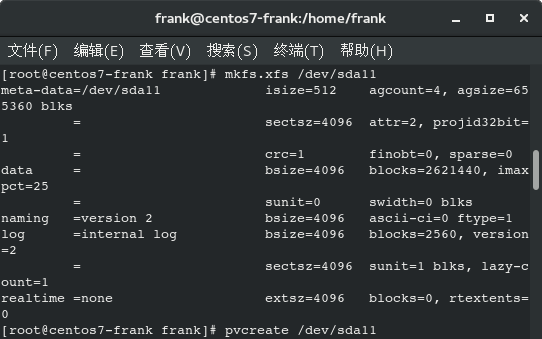

# CentOS7 分区硬盘扩容

### 目 录

[TOC]

Tag：`centos7` `分区` `硬盘扩容` `fdisk` `LVM`

运用虚拟机经常会出现硬盘容量不足的情况，在不改变配置的要求下，直接对根目录增加容量。

centos7的默认安装已经把磁盘管理成LVM的卷形式，可以比较容易扩展磁盘容量。但是centos7在拓展文件分区的时候，很多文章用resize2fs命令，就会报错，LVM使用了XFS的分区文件格式，就不能用该命令了。

目前还有很多使用的硬盘是MBR模式，主分区只能有4个。安装的时候用了2个，一个是swap一个是root，分别使用了两个分区。这样就只能分2个，如果对未来的使用不确定，那么扩展的时候，就不要分主分区，而是扩展分区，为了以后可以多次扩展硬盘容量。

### 1. 新加硬盘

此处有两种操作,后续步骤一致:
(1) 首先是在虚拟机的管理界面，扩大硬盘容量，此处省略，启动机器。
(2) 查看物理机是否有`未分配的分区`,或者新加硬盘。
作者采用的时直接使用原来500GB硬盘上未分配的40GB空间进行扩展(当时装双系统预留的空间,本打算还还给windows的,结果windows不兼容xfs格式,就分给CentOS使用吧)。

然后先看看自己的容量:

### 2. fdisk分区

(1) 选择对硬盘sda进行分区:
> fdisk /dev/sda

(2) 使用n命令;
(3) 会让选第几分区，一般顺序排，就是11(因为我的硬盘之前已经有10个分区了)。然后根据提示创建10G的分区。
> 此处还可能会让选择新建主分区or逻辑分区：
> Partition type:
   p   primary (2 primary, 0 extended, 1 free)
   e   extended
   如果就扩展一次的话，用p选项，如果以后可能多次扩容，选e，我们这里为了简单用了p，建立了一个主分区，然后可以用p命令查看结果。作者的硬盘已经建立了4个主分区，此处就默认只能新建逻辑分区了。

创建分区后，用`w`命令保存。

### 3. 格式化分区

使用`mkfs.xfs`对分区sda11进行格式化，由于作者的root和home分区都是使用的最新的xfs格式，因此此处也格式化为xfs格式；如果你的是ext4，那就格式化为ext4。命令都差不多，都是mkfs.后面加格式：`mkfs.[xfs/ext4]`。

> mkfs.sfx /dev/sda11

### 4. pvcreate建物理卷

在sda11上创建物理卷：
> pvcreate /dev/sda11

查看物理卷状态：
> vgs

显示一下看看物理卷：
> vgdisplay

### 5. 扩容逻辑卷

把新做的sda11分区加入卷，从上面显示 VG Name		centos，卷名是centos：

> vgextend centos /dev/sda11

再查看一下：

发现centos物理卷组已经从67.75GB扩展到77.75G。

查看一下逻辑区的情况：

发现有3个逻辑卷组：root、home和swap，作者想要对home进行扩展。
输入扩展卷组的大小、路径（就是上面LV Path                /dev/centos/home），这里有两种命令：
* > lvextend -L +9.96G /dev/centos/home
* > lvextend -l +100%FREE /dev/centos/home

一个是按大小，一个是按比例，作者采用按比例将10GB的空间全部给home扩容。另外，使用`+10G`的话可能会失败，毕竟着一块空间创建物理卷组后就不会达到10G了，可以使用接近于10G的小数表示。
有些文章里用的是`/dev/mapper/centos-home`，其实都是指向home逻辑卷，都可以。因为我们通过`df -h`查看分区的时候就是显示的`/dev/mapper/centos-home`。

再查看一下逻辑区的情况：

LV Size已经从30.00GB扩展到40.00GB。

下面就是扩展文件系统的尺寸，因为这时候用`df -h`是看不到变大的。

网上文章大多用了`resize2fs`，很遗憾，会显示：
> resize2fs: Bad magic number in super-block

这个命令已经不适应新的系统要求了,应该使用：

> xfs_growfs  /dev/centos/home

显示的最后一行:

> data blocks changed from xxxxxx to xxxxxx

表明已经扩展了。
这时候再用df -h就可以看见容量变大了。

### 5. 磁盘工具查看扩容

使用CentOS7的磁盘管理工具可视化查看分区情况，可以看到11GB的分区11（之前使用fdisk创建的是10G，是按1GB=1024KB，这个磁盘工具是按1GB=1000KB，所以会是11GB,计算法嗯是的差别）。而且侧边栏显示有一个43GB的块设备，之前是和centos-root一样，都是32GB的，现在扩容了。

**至此，一个完整的Linux分区扩容方案交到你的手上，如果不了解Linux的物理卷、逻辑卷、卷组的概念，请google一下。全程所有操作均在root权限下进行，全程高能！请谨慎操作！本教程有可能针对不同机器、不同Linux发行版本有差异，欢迎补充改正，如根据本教程操作个人计算机进行分区前误请做好数据备份，出现任何严重失误均由操作着个人承担。**